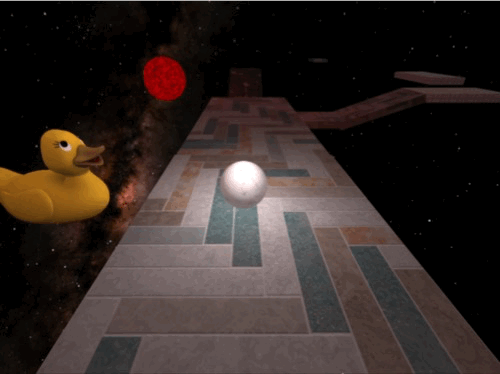

# Celestial Roll Game Engine


Celestial Roll is a physics-based 3D platformer where the player control a sphere navigating through space-themed level filled with various obstacles. The game is developed using a custom C++ game engine with  that employs a component-based architecture inspired by Unity. This architecture allows for high flexibility and modularity, enabling diverse behaviors and properties for game objects through the composition of different components.

## Game Engine Architecture
The game engine leverages a robust system of components, each adding unique properties and behaviors to the game objects:

- [**Transform**](./include/transform.hpp): Manages the object's world position, scale, and rotation (using quaternions).

- [**Renderer**](./include/graphics/renderer.hpp): Handles mesh rendering with materials, dependent on Transform for the object's model matrix.

- [**LightEmitter**](./include/graphics/lightEmitter.hpp): Turns the game object into a light source.

- [**Collider**](./include/collision/collider.hpp): Defines the object's collider type (SphereCollider, AABBCollider, OBBCollider).

- [**PhysicsMaterial**](./include/physics/physicsMaterial.hpp): Specifies properties like friction and bounciness applied during collisions.

- [**RigidBody**](./include/physics/rigidBody.hpp): Applies physics properties such as mass, velocity, and acceleration.

- [**GravityComponent**](./include/physics/gravityComponent.hpp): Adds global gravity to objects (requires a RigidBody component).

- [**BezierAnimation**](./include/bezierAnimation.hpp): Enables object movement along a bezier curve for specified durations.

These components are used within various game objects like [Player](./include/objects/player.hpp), [Camera](./include/objects/camera.hpp), [Platform](include/objects/platform.hpp), and many others.

### Rendering and Physics

**Physics**: Utilizes a fixed update loop at 60 Hz for physics calculations, saving the state before and after the physics changes to eanble interpolation of position, scale and rotation to render at full speed.

**Rendering**: Employs several optimizations such as batching and material, texture, and shader caching to minimize context switches and improve performance. It handles non-opaque objects rendering order and uses UBOs to share common data structs between shaders.

### Input System
Utilizes the observer pattern, allowing objects to extend [InputObserver](./include/input/inputObserver.hpp) and react to key inputs, enhancing interactivity and responsiveness.

## Installation and Running
### Prerequisites

Ensure you have OpenGL and GLFW installed on your system and CMake 3.5.0 or higher. The game is cross-platform and can be built on Windows, macOS (Intel and ARM), and Linux.

### Building the Game

1. Clone the repository:
```bash
git clone https://github.com/PedroKlein/celestial-roll
cd celestial-roll
```

2. Run CMake to generate the build system:
```bash
cmake -DCMAKE_BUILD_TYPE:STRING=Release -DCMAKE_EXPORT_COMPILE_COMMANDS:BOOL=TRUE --no-warn-unused-cli -B./build
````

3. Build the game:
```bash
cmake --build ./build --config Release --target all -j 14
````
### Running the Game

After building, you can run the game executable directly from the build directory:

```bash
./build/celestial_roll
```

### Controls:

 - WASD: Move the sphere/player/camera
 - SPACE: Player jump
 - E: Toggle camera mode (free-cam/eagle view)

### For INF-01047 Avaliation

#### Requisites

##### Max 15% of library code usage
>  Besides glm data structures like glm:vec, glm::mat and glm::quat, the only library usages were [tinyobjloader](https://github.com/tinyobjloader/tinyobjloader), to load .obj files and [stb_image](https://github.com/nothings/stb/blob/master/stb_image.h) to load texture images. ChatGTP and Copilot code will be evaluated at the section [Generative AI Usage](#generative-ai-usage).

##### Complex polygonal meshes
> The main game level/scene uses 4 different meshes, found at [resources/models](./resources/models), 3 have more then 5000 vertices.

<p>
  
  
  
</p>

##### User-controlled geometric transformations



##### Free camera and look-at camera

> Look-at cam and free cam [implementation](./include/objects/camera.hpp).
<p>
  
  
</p>

##### Object instances

> All platform in the game use the same mesh. Player and Star also share the same model as well as the two renders of the look-at and free cameras.

##### Three types of intersection tests

> All collisions are form the point of view of the player. There are three in use at the game and can be foud at [CollisionDetector](./include/input/inputHandler.hpp): sphereToOBB, sphereToAABB and sphereToSphere. There are also two implementations not in use: aabbToAABB and pointToSphere.

##### Diffuse and Blinn-Phong lighting models

> The [default fragment shader](./resources/shaders/default.frag) uses Blinn-Phong lighting model and the [gouraud vertex shader](./resources/shaders/gouraud.vert) uses Diffuse (Lambert) lighting model.

##### Phong and Gouraud interpolation models

> The [default fragment shader](./resources/shaders/default.frag) uses Phong interpolation and the [gouraud vertex shader](./resources/shaders/gouraud.vert) uses Gouraud interpolation. The Gouraud shaders are beeing used to render the camera model for the look-at and free cam.

##### Texture mapping on all objects

> All object need at least a diffuse texture on the [Material class](./include/graphics/material.hpp).

##### Movement with cubic Bézier curve

> There are two uses of bezier curves, which is implemented by the [BezierAnimation component](./include/bezierAnimation.hpp). When the player dies it starts a bezier animation desloacating the player from its current location to the respawn point. There is also a platform that moves accouding to a bezier curve.

<p>
  
  
</p>


##### Time-based animations ($\Delta t$)

> All movements are [time-based](./include/game/game.hpp#47).

#### Generative AI Usage

For this project there was havy usage of generative AI tools like chatGPT and Github Copilot. Initially these tools where used for generating code as well as explaning different methods used in game development. There was several ocurrences of bugs on code generated from these tools which was then used only for getting common pratices in game dev as well as a means to help better organize the code in a structured way that I desired.